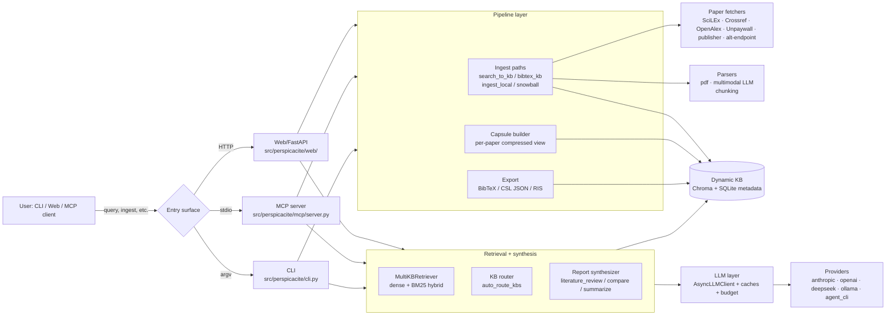

# Perspicacité architecture — one-pager (Wave 7.2)

This document is the single map of the dataflow through Perspicacité.
For details on any one component, follow the links into the
`docs/*` files referenced at the bottom.

## High-level dataflow

## The 5 layers

### 1. Entry surfaces

| Surface | Lives at | Used for |
|---|---|---|
| CLI | `src/perspicacite/cli.py` | Local ingest, ad-hoc queries, exports. |
| Web | `src/perspicacite/web/` | Browser UI + REST API. Streaming chat, KB management, capsule cycle. |
| MCP | `src/perspicacite/mcp/server.py` | Claude Desktop / Cursor / agentic clients. Tools (verbs) + resources (5.1) + prompts (5.2). |

### 2. Pipeline (ingest, transform, persist)

- **Search → KB**: `pipeline/search_to_kb.py` — DOI list → fetch PDFs → parse → chunk → embed → write to Chroma + KB log.
- **BibTeX → KB**: `pipeline/bibtex_kb.py`.
- **Local → KB**: ingest a folder of PDFs.
- **Snowball**: follow citation graph 1+ hops.
- **Parsers**: `pipeline/parsers/{pdf,multimodal}.py`. Wave 4.1 multimodal renders pages → vision LLM → figure/table chunks with `content_type` metadata.
- **Capsule builder**: per-paper compressed view for fast routing decisions.
- **Export**: `pipeline/export_kb.py` produces BibTeX / CSL JSON / RIS side-by-side (Wave 4.5).
- **Provenance + rollback**: `pipeline/kb_log.py` (Wave 4.3) — append-only JSONL per KB. `pipeline/checkpoint.py` (Wave 3.3) — atomic-save resumable ingest state.

### 3. Storage

| Store | Tech | Purpose |
|---|---|---|
| Chunks + embeddings | Chroma (persist_dir) | Vector search. One collection per KB. |
| KB metadata | SQLite WAL (`data/perspicacite.db`) | KB names, descriptions, paper/chunk counts. |
| Provenance store | SQLite + JSON sidecar (`data/provenance/`) | Per-paper retrieval provenance. |
| KB event log | JSONL (`data/kb_logs/{name}.jsonl`) | Append-only history (paper_added / skipped / failed / pruned). |
| LLM disk cache | SQLite WAL (`data/llm_cache.db`) | Wave 2.1 response cache by `(provider, model, messages, temp, ...)`. |
| Embedding cache | SQLite WAL (`data/embedding_cache.db`) | Wave 2.2 per-text vector cache (BLOB-stored float32). |
| ORCID cache | SQLite (`data/orcid_cache.db`) | Wave 4.4 name → ORCID resolution. |
| Checkpoints | JSON files (`data/checkpoints/`) | Resume-friendly run state. |

### 4. Retrieval + synthesis

- **KB router** (`rag/kb_router.py`): given a query, picks 1+ KBs to query. BM25 over KB descriptions + optional LLM-judged routing (Wave 4.2 extended to support time-bounded filters).
- **MultiKB retriever** (`rag/dynamic_kb.py`): dense (BGE / sentence-transformers) + BM25 hybrid. Filters by `SearchFilters` (year, source, content_type — Wave 4.2).
- **Report synthesizer**: takes retrieved chunks + the query → calls the LLM layer with a style-specific system prompt.

### 5. LLM layer

- **AsyncLLMClient** (`llm/client.py`): per-stage provider routing. Wave 3.2 fallback chain — try providers in order, short-circuit on `BudgetExceededError`.
- **Embedding provider** (`llm/embeddings.py`): factory dispatches to LiteLLM (API) or sentence-transformers (local). Wave 2.2 wraps with `CachedEmbeddingProvider`.
- **Disk LLM cache** (`llm/cache.py`, Wave 2.1).
- **Budget tracker** (`llm/budget.py`, Wave 2.4): ContextVar-based per-run cost ceiling.
- **Error surface** (`llm/errors.py`, Waves 3.1 + 3.4): typed `RateLimitError`, `AuthError`, `TimeoutError`. Pattern-based detection on LiteLLM exception bodies.
- **Agent-CLI providers** (`llm/agent_cli.py`, `claude_cli.py`): drive `claude` / `codex` binaries. Wave 2.3 parses JSON token-usage paths.
- **MCP sampling** (`llm/mcp_sampling.py`, Wave 5.3): adapter ready, waiting on upstream issue.

## Cross-cutting concerns

### Configuration

`config/schema.py` is a Pydantic v2 tree:

- `Config.llm` → `LLMConfig` (providers, budget, cache, per-stage routing)
- `Config.knowledge_base` → `KnowledgeBaseConfig` (chunking, embeddings, KB log, checkpoint, ORCID, multimodal, export)
- `Config.databases` → external search backends
- `Config.web`, `Config.mcp` → surface-specific settings

Loaded by `config/loader.py` (YAML + `.env` merge). Six example configs ship in `config/`.

### Observability

- **structlog** everywhere (`logging.py`). Reserved kwargs: never use bare `event=` (use `event_kind=`).
- **Provenance**: every retrieval call records `(query, kb, chunks_returned, scores)` in `ProvenanceStore`.

### Concurrency

- Async-first (asyncio). SQLite uses WAL mode + short-lived connections.
- KB log files: POSIX atomic append for lines ≤ PIPE_BUF. No locks.
- Checkpoint files: tmp + `os.replace` for atomic publish.

### Testing

| Layer | Where | Marker |
|---|---|---|
| Unit | `tests/unit/` | `unit` |
| Integration | `tests/integration/` | `integration` (incl. perf, config audit, MCP smoke, provider matrix) |
| E2E (mocked) | `tests/e2e/` | `e2e` (Wave 6.1) |
| Persistence | `tests/integration/test_persistence_integrity.py` | (Wave 6.2) |
| Perf regression | `tests/integration/test_perf_baseline.py` | `perf` (Wave 6.3) |
| Live (API keys) | `tests/integration/test_provider_matrix.py` | `live` |

CI (Wave 1.5) runs ruff + the non-live test set on push.

## Where to extend

| Goal | Edit |
|---|---|
| New paper source | `pipeline/fetchers/` (HTTP client + DOI/PDF normalisation). |
| New chunking strategy | `pipeline/chunking_advanced.py` and register in `chunking_dispatch.py`. |
| New synthesis style | Add a system prompt in `rag/synthesizer.py` and a router case in `mcp/server.py::generate_report`. |
| New MCP tool/resource/prompt | `mcp/server.py` + register; see `docs/mcp-resources-prompts-2026-05-14.md`. |
| New provider | `llm/providers/` + extend `AsyncLLMClient.complete` dispatch. |
| New export format | `pipeline/export_kb.py` and add `--formats <name>` plumbing. |

## Further reading

- Roadmap: `docs/roadmap-2026-05-followups.md` (Waves 1–7 status).
- Recipes: `docs/recipe-book-2026-05-15.md`.
- Wave-specific guides:
  - LLM cache: `docs/llm-cache-2026-05-14.md`
  - Embedding cache: `docs/embedding-cache-2026-05-14.md`
  - Budget caps: `docs/budget-caps-2026-05-14.md`
  - Rate-limit handling: `docs/rate-limit-2026-05-14.md`
  - Fallback chain: `docs/fallback-chain-2026-05-14.md`
  - Checkpoint resume: `docs/checkpoint-resume-2026-05-14.md`
  - Error modes: `docs/error-modes-2026-05-14.md`
  - Multimodal extraction: `docs/multimodal-extraction-2026-05-14.md`
  - Time-bounded queries: `docs/time-bounded-queries-2026-05-14.md`
  - Export formats: `docs/export-formats-2026-05-14.md`
  - Versioned KBs (kb_log): `docs/versioned-kbs-2026-05-14.md`
  - ORCID disambiguation: `docs/orcid-disambiguation-2026-05-14.md`
  - MCP resources + prompts: `docs/mcp-resources-prompts-2026-05-14.md`
  - E2E validation suite: `docs/e2e-validation-2026-05-15.md`
- Agent-CLI caveats: `docs/agent-cli-caveats.md`.
